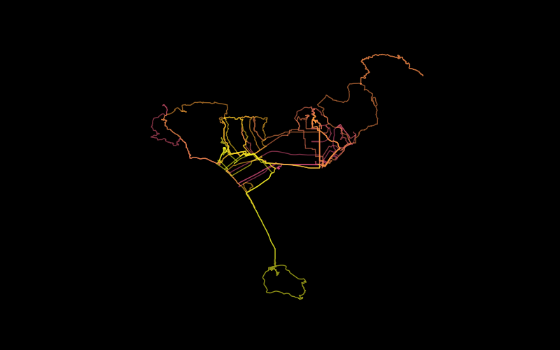

GPX Visualization
===

## Introduction

Plot multiple GPX trail on the canvas by a single script.

Can further generate progressive video of how the trails are explored.

## Prerequisites

* python3
* gpxpy
* matplotlib
* imageio
* ImageMagick (optional)

## Basic function

Put all `.gpx` files in a directory. 

e.g.

```
gpxv/
    main.py
    mytrails/
        some_ride.gpx
        another_ride.gpx
        ...
```

Then exectue

```
python3 main.py mytrails
```

To get the picture as `0.png`.

An example result



## Advanced functions

### Overlay two or more person's trails in different color

Put `gpx` files in different directorys. 

e.g.

```
gpxv/
    main.py
    aoaotrails/
        some_ride.gpx
        another_ride.gpx
        ...
    ninatrails/
        some_ride_with_aoao.gpx
        another_ride_without_aoao.gpx
        ...
```

Then exectue

```
python3 main.py aoaotrails ninatrails
```

The result is the overlay of the riders in `combined.png`.

An example result


* Yellow: rider 1's trails
* Purple: rider 2's trails
* Pink: their common trails

### Plotting progressive pictures and generating video

Set `PRINT_PROCESS` environment to any non-empty value to enable printing 
the process of riding according to the time. 

The generated pictures are stored in `process` directory.

Then, `ffmpeg` or other tools can be used to generate a video.

An example result


